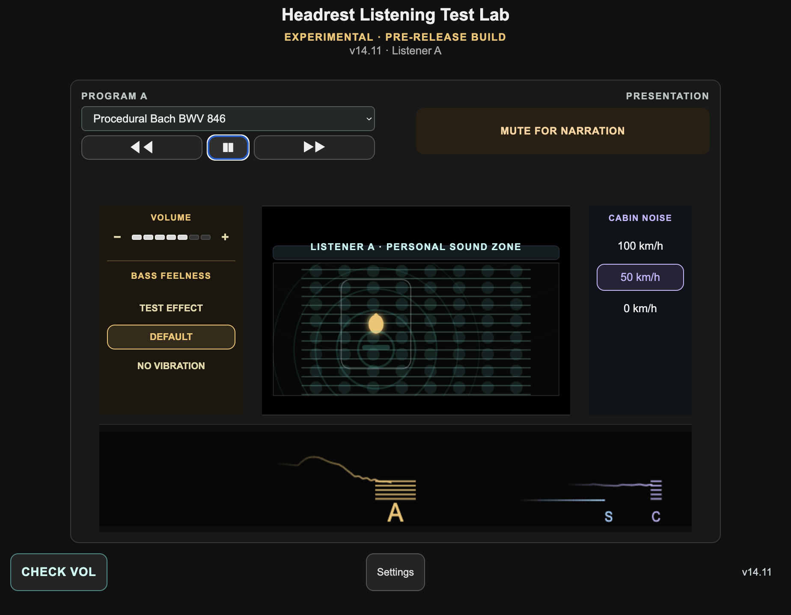
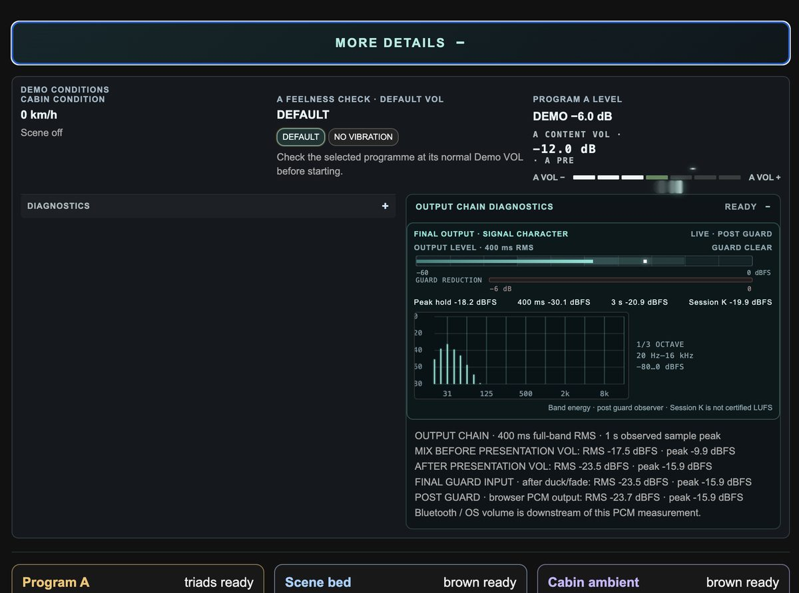
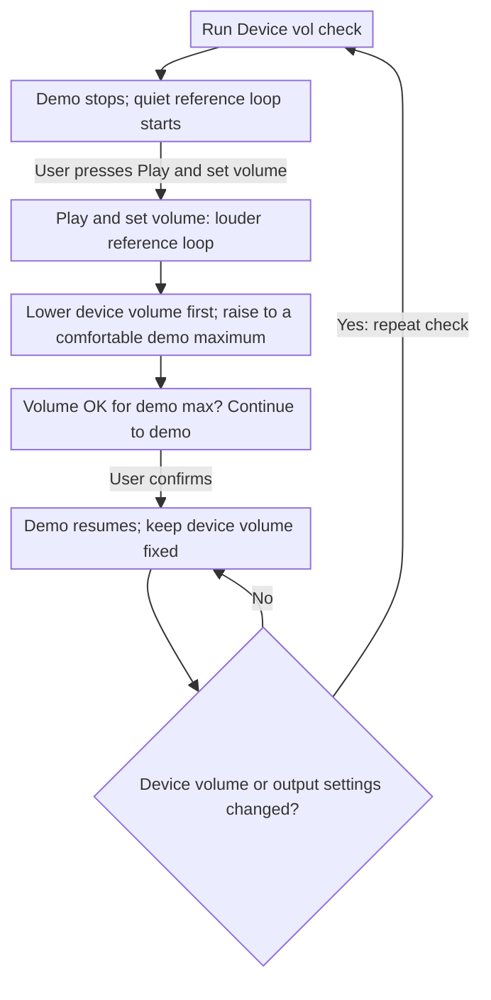
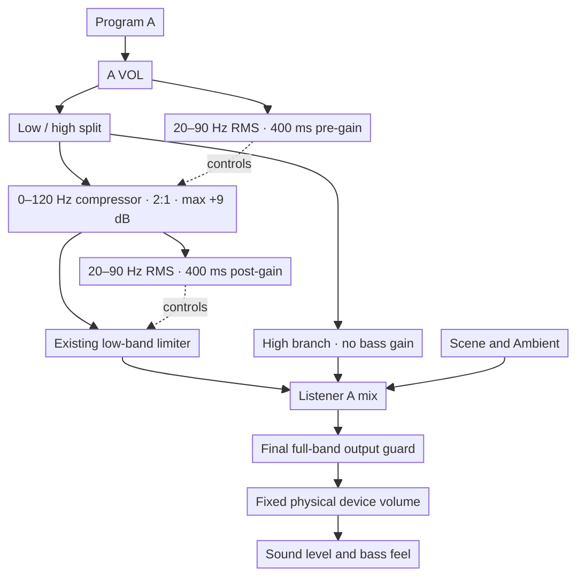

# Headrest Listening Test Lab v14.11

Standalone release for the one-listener headrest listening test lab. The GitHub Pages entry point is [`index.html`](index.html).

## v14.11 release screenshot

## Current status — 2026-10-08

- **Repository:** v14.11 keeps the demo hidden for two seconds while the fixed-volume reminder is read, then fades it in over one second; playback starts at three seconds. The phase 2 panel stays visible while its test cue stops. v14.9 removed the redundant Lab Diagnostics continuation button; long-press Lab Settings to open or hide details. v14.8 updated Research Focus, moved copyright into version information, and numbered the Device vol check actions. v14.6 fixes the version-info opener target and adds space below the Bass Feelness heading. v14.5 hides the Lab Settings route behind the version info dialog; the advanced details have no visible disclosure and open only by long-pressing the Lab Settings heading. v14.4 fixes the protection note's undefined previewText reference; v14.3 keeps the Program A playlist and live spectrum / low-band net gain / output guard at the top. Device vol check is aligned with the Demo-only view toggle. MORE DETAILS contains Demo Conditions and the remaining Lab controls. One open-by-default Diagnostics panel now combines low-band and output-chain readouts. The level tile shows Demo output and A content volume. Separate compressor and limiter readings are in Diagnostics; the signed net-gain meter stays in the live summary. Output-chain diagnostics list intermediate points only; final post-guard level is shown in the Final Output panel. Dynamic numeric readouts refresh every 0.5 s, while meters and spectra keep their smooth visual updates. The mute icon updates only when mute state changes so its opacity pulse is not restarted by protection telemetry. Diagnostics use a compact two-column layout on desktop and one column on mobile. The page is marked EXPERIMENTAL · PRE-RELEASE BUILD. v14.0 formatted Output Chain Diagnostics as discrete rows beside the Final Output spectrum, removed the cursor-dependent car probe while keeping the heatmap, and softened the upper-limit reminder with a 1-second fade in and 3-second fade out. v14.1 caps the Spill Demo compressor boost at +9 dB; the shared worklet retains a +12 dB default for other labs, and the displayed meter scale stays at −18…+12 dB. v14.3 starts the 3-second TEST EFFECT auto-off from click. A long press stays active only while held; losing pointer capture completes the release, and pause/stop still clears it. Listener A controls are ordered as title, A VOL, divider and Bass Feelness. The Listener A and Cabin Noise container borders are removed; MUTE FOR NARRATION shows its border only while muted. The redundant START DEMO action was removed; playback remains on the existing transport. Audio routing is unchanged; v14.1 changed the demo's maximum compressor boost. v13.27 softened the low-level curve from 3:1 to 2:1; v13.26 set the +12 dB cap and restored the signed combined-gain meter.
- **Low-level compressor:** Program A only. A 400 ms 20–90 Hz RMS detector before gain controls the existing 0–120 Hz low branch with a 2:1 upward-compression curve, a 3 dB soft knee, and a +9 dB cap in this demo. Gain smoothing uses 25 ms attack and 250 ms release. The limiter receives its own 400 ms detector level after compressor gain, so its existing threshold remains the upper bass limit. The high branch, Scene, Ambient, and final output guard are unchanged.
- **Feelness modes:** compression remains enabled in DEFAULT and NO VIBRATION; the active Feelness threshold shifts the compressor curve. TEST EFFECT disables both compressor and limiter while its separate +6 dB Program A test is active.
- **Diagnostics:** the signed meter shows actual net low-band gain: compressor boost minus limiter reduction, on a −18…+12 dB scale. Separate readouts show pre/post detector RMS, threshold, compressor gain, limiter reduction, and Program A full-band RMS. TEST EFFECT shows only the hypothetical compressor boost as a grey bar while labelling protection off. Values are digital dBFS/dB, not acoustic SPL, and refresh every 0.5 seconds.
- **Temporary limiter check:** default Demo VOL is −6 dB instead of −12 dB. With the completed HW check's 0 dB reference, the active low-band threshold should read −12 dBFS. Keep the physical device volume fixed while comparing the same Bach passage and A VOL.
- **Sites:** the hosted mobile test is still v13.18 and remains unchanged during desktop testing.
- **Device vol check:** starting it silences the current demo and plays the E-major test cue quietly as orientation. The user then starts the louder, fixed digital reference, lowers the physical device volume first, and raises it to a comfortable maximum. The user advances the stages manually and continues to the demo. The cue loops until the user changes stage or cancels.
- **Limits:** no microphone measurement is used. The browser cannot read physical device volume or guarantee an acoustic SPL. The digital reference and output protection provide a repeatable starting point, not an exact acoustic calibration.
- **During the demo:** keep physical/device volume fixed. Re-run the check if it changes. Ambient stays at the selected scene level as the background condition; it does not automatically compensate for a noisy room. A VOL adjusts Program A content relative to that ambient bed.
- **Demo VOL:** its visible control is removed. A separate demo-wide trim or “Set Demo VOL” step remains undecided; A VOL is a distinct Program A content control.

This current-status section supersedes earlier hardware-setup notes below where they imply a visible Demo VOL control or an already-settled demo-wide volume step.

### v14.11 — Hold the reminder before revealing the demo

- Keep the demo surface hidden for two seconds after the fixed-volume reminder appears, fade it in over one second, then start playback at three seconds.
- Keep Device vol check phase 2 visible and disable its controls while the test cue is stopping, preventing a brief blank phase.
- Under reduced-motion preference, reveal the demo immediately after the two-second reading hold.

### v14.10 — Show the demo before resuming playback

- After the volume check, show the fixed-volume reminder, switch to and scroll to the demo view, then fade the demo surface in behind the reminder.
- Wait three seconds after showing the reminder before starting demo playback.
- Respect reduced-motion preferences by skipping the opacity transition.

### v14.9 — Remove redundant diagnostics continuation

- Remove the Continue to Lab Diagnostics button; long-press Lab Settings to reveal or hide advanced details.
- Update the version information and long-press hint to describe the single access method.

### v14.8 — Clarify research focus and volume check stages

- Rewrite Research Focus for the current A-only lab: cabin ambient, optional Scene content, and low-band compression/limiting. Clarify that digital estimates support listening tests and are not validated acoustic or safety measurements.
- Move the author copyright into the version information dialog; keep the measurement disclaimer by the diagnostics.
- Number the Device vol check actions: “1. START VOL CHECK” and “2. VOL OK · CONTINUE TO DEMO”.

### v14.7 — Separate footer actions and add Lab Diagnostics step

- Left footer action opens Check Vol directly, the center toggles Settings / Back to demo, and the right version label opens release information.
- Add a Continue to Lab Diagnostics button at the end of the primary Settings panel; it reveals the advanced section. The section remains hidden by default and closes when returning to demo.

### v14.6 — Fix version info trigger and space Bass Feelness controls

- Match the release-info click handler to the version button's actual HTML ID.
- Add a blank row of spacing after the Bass Feelness heading.

### v14.5 — Hide Lab Settings and advanced details

- Make the footer release label open a version information dialog with a Lab Settings action.
- Rename the Demo Settings card to Lab Settings. Keep its advanced details hidden until a long press on the panel title; provide a visible hide action and collapse details when returning to the demo.
- Remove the visible Listener A caption above A VOL and increase spacing before Bass Feelness.

### v14.4 — Fix protection preview note scope

- Render the hypothetical protection note directly from the in-scope preview gain, avoiding a runtime ReferenceError during animation and meter updates.
- Bump page asset revisions so browsers load the fixed app module.

### v14.3 — Trigger TEST EFFECT timeout from click

- A short click applies TEST EFFECT for three seconds. A long press keeps it active while the control is held; the generated click after a long press is ignored so it does not start a timer.
- Losing pointer capture completes the release path; pointer cancellation still cancels the effect.
- Listener A controls now show the title and volume before Bass Feelness, separated by a divider. The Listener A and Cabin Noise container borders are removed; the MUTE FOR NARRATION border appears only while muted.

### v14.0 UI reference

## Device volume and limiter setup logic

Device vol check establishes a practical maximum for the physical device volume. The low-band limiter then operates against a digital threshold with that device setting held fixed. This workflow does not measure acoustic SPL or automatically calibrate the limiter's physical bass limit.

### Device vol check

Both reference phases loop until the user advances or cancels. The louder cue uses a fixed 0 dB digital reference gain; this is a gain setting, not a measurement of acoustic SPL or a claim that the waveform peaks at 0 dBFS. On confirmation, the window closes and the demo continues after a one-second pause; the reminder fades in over one second and begins fading out after five seconds, completing its fade after three more seconds: “Demo upper limit setting ready. Use app controls only for volume. If device settings change, run this check again.”

### Demo level and protection

- **Compressor detector:** observes 20–90 Hz RMS before its gain, so the gain decision cannot feed itself.
- **Limiter detector:** observes the same detector band after compressor gain. The existing limiter therefore catches bass raised by the compressor.
- **A VOL:** changes Program A before both detector and compressor; Demo VOL remains after low-band protection.
- **NO VIBRATION / DEFAULT:** both retain low-level compression, using their respective effective thresholds. **TEST EFFECT** bypasses both stages.
- **Ambient and final guard:** Ambient stays on its existing parallel path. The final guard remains after the mix and is unchanged.

Limiter accuracy in acoustic terms remains uncertain. This check provides a repeatable starting point, but it cannot guarantee an acoustic bass-limit accuracy of approximately ±6 dB. A separate bass-limit fine-tuning step is a possible future addition. A demo-wide Demo VOL trim also remains undecided.

---

## v13.14 — Guided hardware-volume setup

- Replace the separate Normal Demo Reference and HW Master Reference cards with one guided setup card.
- Start HW Setup stops current demo audio and plays the existing E-major reference quietly for orientation, then asks the user to lower device volume before replaying it at the fixed 0 dB digital reference.
- On continue, keep the physical device setting fixed, restore the prior Demo VOL, anchor the Locked protection curve at 0 dB, and start the demo. This is a practical relative setup; the browser does not measure device volume or exact acoustic SPL.
- Audio routing and limiter processing remain unchanged; the cue gain only controls the quiet orientation playback level.

## v13.13 — Smooth Show Bass Feel shutdown and meter the limiter

- Keep the dedicated triad route. Show Bass Feel reports the filtered detector level, the exact low-band target and measured gain reduction alongside final-output peak and final-guard reduction.
- Hold Presentation VOL controls steady during a cue so the displayed target and applied gain remain aligned.
- After playback ends, keep the bass-protected route connected for 80 ms (15 ms for calibration) so the 50 ms protection delay and final guard can drain before disposal.
- Remove experimental quiet/present/strong colours from the final-output RMS bar. Keep its temporal histogram, constant fill colour, peak marker and guard-reduction display.

## v13.12 — Isolate Setup Cue output analysis

- Reset final-output analysis history at the start of Setup Cue or Bass-feel replay, so previous playback cannot leak into the cue's spectrum, RMS, peak or Session K readings.
- Reuse the working post-guard analyzer for cue peak and guard telemetry; label the value as final-output peak instead of an independent pre-guard measurement.
- Speed only the final-output spectrum release to 70 ms (20 ms attack). Program A and other analyzers retain their existing 350 ms release and 50 ms attack.

## v13.11 — Calibrate HW master reference with Setup Cue