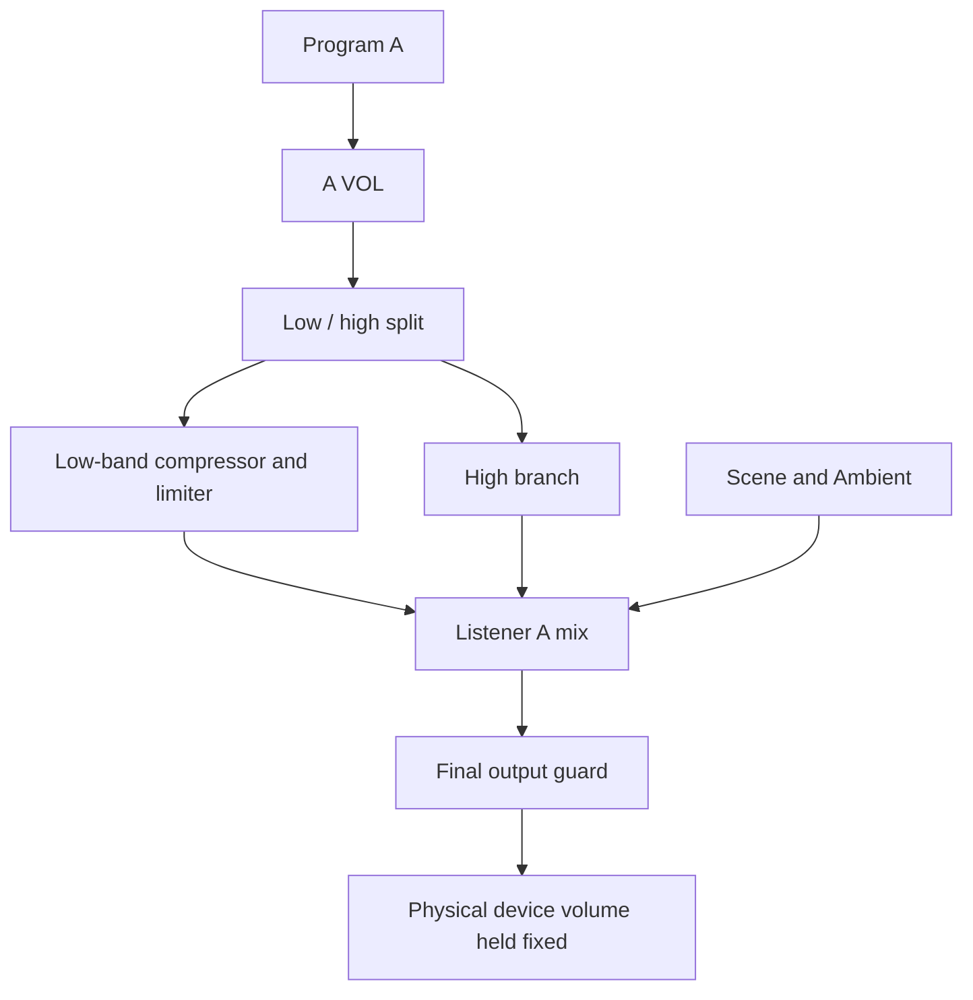

# Headrest Listening Test Lab · v14.11

**Release repository.** This repository contains the v14.11 snapshot published through GitHub Pages. Active development continues in the private [audio-labs development repository](https://github.com/JukkaTLinjama/audio-labs/tree/main/noise-masking-lab/spill-demo-dev). Changes should be made there first, then copied here when preparing a release.

The site is a static page with no build step. GitHub Pages serves `index.html` and its adjacent CSS and JavaScript files from the `main` branch root.

## Release screenshot

## What this release contains

- A single-listener A demo with cabin ambience, Program A playback, A VOL, Bass Feelness modes, and live diagnostics.
- Device volume check with quiet orientation and louder reference cues. The demo remains hidden while the fixed-volume reminder is shown, fades in after two seconds, and playback starts after three seconds.
- TEST EFFECT turns off automatically three seconds after a click; a long press keeps it active until release.
- The demo's low-level Program A compressor is capped at +9 dB. The diagnostic gain scale remains −18…+12 dB.
- Lab Settings and advanced diagnostics are intentionally tucked away from the main demo flow.

## Audio chain

The low-band compressor uses a 20–90 Hz RMS detector with a 400 ms window before gain. The limiter detector observes the signal after compressor gain so it can catch bass added by compression. Scene and Ambient remain on their existing parallel path, and the final full-band output guard remains after the mix.

## Device volume and measurement limits

Run Device vol check before the listening demo, then keep the physical device volume fixed. The browser cannot read the device volume or measure acoustic SPL. Displayed dBFS values are digital signal estimates, not sound-pressure measurements; the check provides a repeatable starting point, not an exact acoustic calibration. Ambient remains the selected background condition and does not automatically compensate for a noisy room.

A demo-wide Demo VOL trim is not part of this release. A VOL changes Program A relative to the ambient bed.

## Research focus

This experimental lab explores how cabin ambience, optional Scene content, and low-frequency compression or limiting affect perceived bass feelness and masking. The diagnostics support controlled listening comparisons; they are not validated acoustic or safety measurements.

Copyright © Jukka T. Linjama, 2026.
